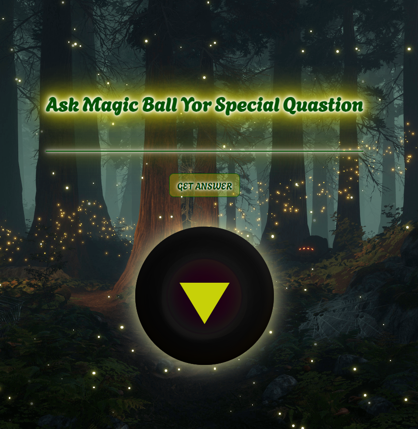

<h1 align="center" id="title">✨Yes or No App✨</h1>

The Yes or No app was a simple project where I practiced my JavaScript skills. It is built on top of a beginner-friendly technology stack. Try my simple application just ask a question and get an answer.

  
  
<h2>💻 Built with</h2>

Technologies used in the project:

*   HTML
*   CSS
*   JS
*   Fetch

